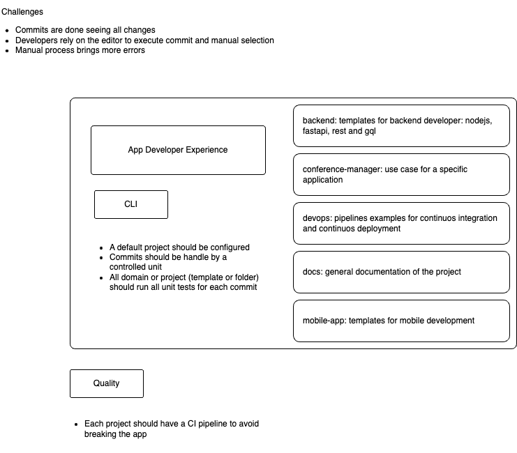

# App Developer Experience

This is a project to build an application using microservices considering a monorepo

## Content

- [Content](#content)
- [Folder structure](#folder-structure)
- [Conventional commits](#conventional-commits)
  - [Why use node tools for conventional commits](#why-use-node-tools-for-conventional-commits)
  - [Requirements](#requirements)
- [GenAI](#genai)
- [Relevant information](#relevant-information)

## Folder structure

- mobile-app: use different technologies to build a mobile app
  - whitewalker: app with react native standalone
  - whitewolf-rn: app using expo
- backend: using nodejs and python to build microservices
  - ms-nestjs-gql-tpl: build microservice using nodejs, nestjs with graphql
  - [ms-nestjs-rest-tpl](./backend/ms-nestjs-rest-tpl/README.md): build microservice using nodejs, nestjs for rest
  - [ms-fastapi-rest-tpl](./backend/ms-fastapi-rest-tpl/README.md): build microservice using python, fastapi for rest
- [conference-manager](./conference-manager/README.md):
  - docker-compose: orchestrate all the elements of the solution
  - [ms-conference-webapp](./conference-manager/ms-conference-webapp/README.md): webapp to connect with ms-conference-api to bring all data
  - [ms-conference-admin](./conference-manager/ms-conference-admin/README.md): microservice to show an admin dashboard to manage all information
  - [ms-conference-api](./conference-manager/ms-conference-api/README.md): microservice to handle all REST operations
- docs:
  - [code review](./docs/CodeReview.md): guideline for an effective code review
  - [security](./docs/Security.md): guideline to consider all security aspects to develop solutions with containers
- devops:
  - deploy_infrastructure: added all files to deploy a infrastructure as code using terraform
- [cloud](./cloud/README.md):
  - terraform:
    - aws: added terraform code to deploy en aws

## Understanding the challenges

Because Microservices is on trending, most of the companies believe managing multiple repos, is the best way to go.
However, Monorepos brings another perspective and also some challenges to be consider before using it.



## Conventional commits

In order to handle all projects and packages, the project requires:

- nodejs v22.15.0
- husky
- @commitlint/cli
- @commitlint/config-conventional
- conventional-changelog-cli

### Why use Node tools for Conventional commits?

Because:
• Node ecosystem is well-known for building libraries to implement and enforce connventional commits.
• Commitlint is the most mature and flexible tool for enforcing Conventional Commits.
• Husky is the most popular Git hooks manager — works across any tech stack (Python, JS, Go, etc.).

It’s completely fine and common to install these tools just for Git hook purposes in any project, including Python.

### Requirements

- Install nvm
- Run the following commands

```bash
# install specific version of nodejs
nvm install v22.15.0
# set node version in current shell
nvm use v22.15.0
# installing husky validations
make setup-commit-validation
```

### Additional commands

```bash
# create nodejs rest template
make create-nodejs-rest
# create nodejs gql template
make create-nodejs-gql
# create fastapi-rest-template
make create-py-rest
```

## GenAI

Based on the effiency of copilot and agents, there is a new configuration to handle custom agents.

## Tools

Software excellence means take advantage of tooling to automate and standarize the SDLC.

[Review all tools](./docs/Tooling.md)

## Relevant information

- [Testing](./docs/Testing.md) to understand how to test different parts of the SDLC.
- [Security](./docs/Security.md) to understand security considerations to implement a secure application.
