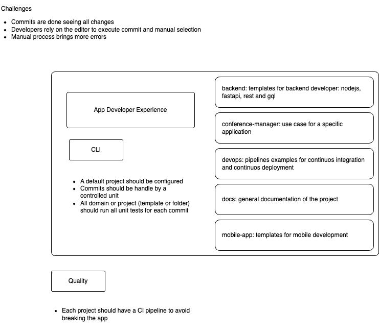

# App Developer Experience (ADE)

A learning-focused monorepo that demonstrates the full breadth of modern software
development: microservices, mobile apps, CI/CD pipelines, cloud infrastructure,
and AI-assisted development — all living in a single repository.

The goal is to show how a monorepo gives an engineering organization **shared
visibility** across every process: from a developer's first commit, through
automated testing and container builds, all the way to cloud deployment.

---

## Contents

- [Why a Monorepo?](#why-a-monorepo)
- [What's Inside](#whats-inside)
- [Architecture Overview](#architecture-overview)
- [Key Learning Concepts](#key-learning-concepts)
- [Getting Started](#getting-started)
- [Commit Convention](#commit-convention)
- [Documentation](#documentation)

---

## Why a Monorepo?

Most companies instinctively reach for one-repo-per-service when adopting
microservices. Monorepos are the deliberate counter-argument — and the industry
data is compelling:

- **Google** has operated a single repository ("Piper") with over 2 billion files
  and ~45,000 daily commits for decades. Their internal study found that developer
  productivity increased when cross-team dependencies were visible and atomic.
  ([Why Google Stores Billions of Lines of Code in a Single Repository — CACM, 2016](https://cacm.acm.org/magazines/2016/7/204032-why-google-stores-billions-of-lines-of-code-in-a-single-repository/fulltext))

- **Microsoft** moved Windows development into a single Git monorepo (~300 GB,
  ~4,000 engineers). The key insight was that visibility into cross-team changes
  eliminates the "works on my service, breaks yours" problem.
  ([Scaling Git to Microsoft — InfoQ, 2017](https://www.infoq.com/articles/git-microsoft-developer-tools/))

- **Meta, Twitter, Airbnb, and Uber** all operate monorepos for core platform
  code. The pattern is consistent: when teams share code, a shared repo reduces
  coordination overhead that otherwise shows up as broken integrations and
  duplicated tooling.
  ([Monorepos in the Wild — InfoQ, 2019](https://www.infoq.com/presentations/monorepo-tools/))

- The **ThoughtWorks Technology Radar** has repeatedly endorsed the monorepo
  technique, noting that a single repo makes cross-boundary refactoring
  straightforward and enforces consistency in tooling and standards.
  ([ThoughtWorks Radar — Monorepo](https://www.thoughtworks.com/radar/techniques/monorepo))

**In this repo:** you can trace a feature from a backend template commit, through
a CI pipeline, to an infrastructure plan, and into a cloud deployment — all
within a single `git log`.



---

## What's Inside

| Domain | Path | Stack |
|---|---|---|
| Conference Manager (full solution) | `conference-manager/` | Django, FastAPI, Next.js |
| Backend microservice templates | `backend/` | NestJS, FastAPI |
| Mobile app templates | `mobile-app/` | React Native, Expo |
| DevOps pipeline templates | `devops/` | GitHub Actions, Docker |
| Cloud infrastructure | `cloud/terraform/` | Terraform (AWS + Azure) |
| AI Agents | `agents/` | Claude Code SDK |
| CLI tooling | `cli/` | Python |
| Shared documentation | `docs/` | — |

---

## Architecture Overview

```
app-developer-experience/
├── conference-manager/          # Full reference solution
│   ├── ms-conference-api/       #   RESTful API (FastAPI)
│   ├── ms-conference-admin/     #   Admin dashboard (Django)
│   ├── ms-conference-webapp/    #   Web frontend (Next.js)
│   └── docker-compose/          #   Local orchestration
├── backend/                     # Microservice templates
│   ├── ms-nestjs-rest-tpl/      #   NestJS REST
│   ├── ms-nestjs-gql-tpl/       #   NestJS GraphQL
│   └── ms-fastapi-rest-tpl/     #   FastAPI REST
├── mobile-app/                  # Mobile templates
│   ├── whitewalker/             #   React Native (standalone)
│   └── whitewolf-rn/            #   Expo
├── cloud/                       # Infrastructure as Code
│   └── terraform/
│       ├── aws/                 #   AWS (ECS, ECR, VPC)
│       └── azure/               #   Azure equivalents
├── devops/                      # Reusable pipeline job definitions
│   ├── ci-aws-backend/          #   Backend container CI → AWS ECR
│   ├── ci-aws-webapp/           #   Webapp container CI → AWS ECR
│   └── deploy_infrastructure/   #   Terraform plan/apply/destroy
├── .github/workflows/           # GitHub Actions entrypoints (use devops/ jobs)
├── agents/                      # AI agent definitions (Claude Code SDK)
│   ├── frontend/                #   Frontend planner + developer agents
│   ├── infrastructure/          #   Infra planner, developer, pipeline debugger
│   └── shared/context/          #   Shared paths + conventions
├── cli/                         # Interactive conventional commits CLI (Python)
└── docs/                        # Cross-cutting documentation
```

> **Pipeline note:** `devops/` holds reusable job templates; `.github/workflows/`
> holds the actual entrypoints that GitHub Actions triggers. The two directories
> work together — neither is complete without the other.

---

## Key Learning Concepts

### Domain Driven Design (DDD)
Every microservice organizes its code around the business domain, not technical
layers. `domain/`, `application/`, and `infrastructure/` are the three mandatory
layers. See any service under `backend/` for a concrete example.

### Clean Architecture
The dependency rule is enforced: inner layers (domain) never import from outer
layers (infrastructure). This makes unit-testing business logic trivial and
keeps framework concerns at the edges.

### Container-First
Every service ships as a Docker image built with multi-stage Dockerfiles — only
production dependencies in the final image, no dev tooling. See the `Dockerfile`
in each service directory.

### CI/CD Visibility
All pipelines follow a consistent naming convention in `.github/workflows/`:

| Prefix | Triggers on | Purpose |
|---|---|---|
| `pull_request_*` | Every PR | Lint, unit tests, Terraform plan |
| `ci_*` | Merge to main | Build, push to ECR, deploy |
| `validate_commits` | Every push | Enforce conventional commits |

### AI-Assisted Development
The `agents/` directory contains Claude Code agent definitions that automate
frontend migration planning, infrastructure audits, and CI/CD debugging. Each
agent follows a **planner → human review → developer** handoff pattern.
See [AGENTS.md](./AGENTS.md) for the full index and orchestration rules.

### Observability
The Conference Manager ships with Prometheus metrics and Grafana dashboards
deployed alongside the application services, demonstrating how production
observability is built from day one — not added later.

---

## Getting Started

### Prerequisites

- Node.js v22.15.0 (via nvm)
- Docker + Docker Compose
- Terraform >= 1.5
- Python 3.11+
- Act

### Scaffold a new microservice

```bash
make create-nodejs-rest   # NestJS REST template
make create-nodejs-gql    # NestJS GraphQL template
make create-py-rest       # FastAPI REST template
```

### Use the interactive commit CLI (Still In progress)

```bash
cd cli
make interactive-commit   # guided conventional commit prompt
make basic-commit         # non-interactive commit
```

---

## Commit Convention

This repo enforces [Conventional Commits](https://www.conventionalcommits.org/)
via Husky + Commitlint. Format: `type(scope): description`

| Type | Use for |
|---|---|
| `feat` | New feature |
| `fix` | Bug fix |
| `chore` | Tooling, deps, config |
| `refactor` | Code restructuring (no behavior change) |
| `docs` | Documentation only |
| `test` | Tests only |

Scopes should match the affected package: `cm-api`, `cm-webapp`, `ms-nestjs-rest`, etc.

Node tooling is used for commit hooks regardless of the service's language because
Husky is the most mature Git hook manager and Commitlint is the most flexible
enforcement tool — both work across any tech stack.

---

## Documentation

| Topic | Link |
|---|---|
| DevOps pipelines | [docs/DevOps.md](./docs/DevOps.md) |
| Testing strategy | [docs/Testing.md](./docs/Testing.md) |
| Security guidelines | [docs/Security.md](./docs/Security.md) |
| Tooling overview | [docs/Tooling.md](./docs/Tooling.md) |
| Code review guidelines | [docs/CodeReview.md](./docs/CodeReview.md) |
| AI Agents index | [AGENTS.md](./AGENTS.md) |
| Cloud deployment | [cloud/README.md](./cloud/README.md) |
| Conference Manager | [conference-manager/README.md](./conference-manager/README.md) |
