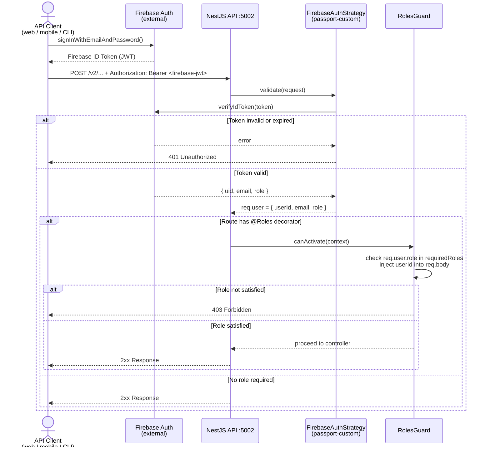

# Authentication & Authorization

This API uses **Firebase Authentication** as the identity provider. Firebase issues signed JWT tokens that the NestJS layer validates on every protected request. No session state is stored server-side.

---

## How It Works

### Token issuance (client responsibility)

Clients authenticate directly with Firebase using the Firebase Client SDK (web, mobile, or REST). Firebase returns an **ID token** — a signed JWT — that must be sent with every API request that requires authentication.

```
Authorization: Bearer <firebase-id-token>
```

The token contains three claims the API reads:

| Claim | JWT field | Maps to |
|---|---|---|
| Firebase UID | `sub` | `req.user.userId` |
| Email | `email` | `req.user.email` |
| Role | `role` | `req.user.role` |

> The `role` claim is a **custom claim** that must be set on the Firebase user record (e.g. `"admin"` or `"user"`). Use the Firebase Admin SDK `setCustomUserClaims()` to assign it.

### Token validation (API responsibility)

The API validates tokens using `passport-jwt` and `FirebaseAuthStrategy`:

```
src/modules/firebase-auth/firebase-auth.strategy.ts
```

The strategy verifies the JWT signature against the Firebase private key (`PRIVATE_KEY_V2` env var). If validation succeeds, `req.user` is populated with `{ userId, email, role }`.

---

## Auth Flow

The NestJS API uses Firebase as its IdP. This is a separate auth from tools apps such as grafana and unleash.



---

## Protection Levels

There are three levels of protection used across the API.

### 1. Public — no token required

No guards applied. Any caller can reach this endpoint.

```typescript
@Post('reset-password')
@HttpCode(204)
async resetPassword(@Body() dto: ResetPasswordDto) { ... }
```

### 2. Authenticated — valid JWT required

`AuthGuard('jwt')` is applied. The token must be valid and not expired. The caller's role is not checked.

```typescript
@Post('revoke-token')
@UseGuards(AuthGuard('jwt'))
@HttpCode(200)
async revokeToken(@Req() req: Request) {
  const uid = (req.user as any).userId  // populated by the guard
  ...
}
```

### 3. Admin — valid JWT + `admin` role required

Both `AuthGuard('jwt')` and `RolesGuard` are applied. The JWT must be valid **and** `req.user.role` must include `"admin"`. The `RolesGuard` also automatically injects `userId` into `req.body` so services receive the caller identity without the controller needing to pass it.

```typescript
@Post()
@Roles(ADMIN_ROLE)                              // declares required role
@UseGuards(AuthGuard('jwt'), RolesGuard)        // order matters: jwt runs first
@HttpCode(201)
async create(@Body() dto: CreateConferenceDto) { ... }
```

> **Order matters.** Always put `AuthGuard('jwt')` before `RolesGuard` in the `@UseGuards()` call. `RolesGuard` reads `req.user` which is populated by the JWT guard.

---

## Protecting a New Endpoint

### Step 1 — Apply the guards

```typescript
import { UseGuards } from '@nestjs/common'
import { AuthGuard } from '@nestjs/passport'
import { RolesGuard } from '../guard/roles.guard'
import { Roles } from '../guard/roles.guard.decorator'
import { ADMIN_ROLE } from '../../common/constants'

// Admin-only
@Get('/admin-resource')
@Roles(ADMIN_ROLE)
@UseGuards(AuthGuard('jwt'), RolesGuard)
async adminOnly() { ... }

// Any authenticated user
@Get('/my-resource')
@UseGuards(AuthGuard('jwt'))
async authenticated(@Req() req: Request) {
  const { userId, email, role } = req.user as any
  ...
}
```

### Step 2 — Add `userId` to write DTOs (admin routes only)

`RolesGuard` injects `userId` into `req.body` before the controller runs. Any DTO on an admin write route must declare this hidden field or `ValidationPipe` will reject it.

```typescript
import { ApiHideProperty } from '@nestjs/swagger'
import { IsOptional } from 'class-validator'

export class CreateSomethingDto {
  // ... your fields

  @ApiHideProperty()   // hidden from Swagger UI
  @IsOptional()
  userId?: string      // injected by RolesGuard
}
```

### Step 3 — Document in Swagger

Create a decorator in `src/infrastructure/swagger/v2/` and apply it to the endpoint:

```typescript
// src/infrastructure/swagger/v2/create-something.decorator.ts
import { applyDecorators } from '@nestjs/common'
import { ApiBearerAuth, ApiBody, ApiResponse } from '@nestjs/swagger'
import { CreateSomethingDto } from '../../../modules/something/dto/create-something.dto'

export function CreateSomethingSwaggerDecorator() {
  return applyDecorators(
    ApiResponse({ status: 201, description: 'Resource created.' }),
    ApiResponse({ status: 400, description: 'Validation error.' }),
    ApiResponse({ status: 401, description: 'Unauthorized.' }),
    ApiResponse({ status: 403, description: 'Forbidden — admin role required.' }),
    ApiBody({ type: CreateSomethingDto }),
    ApiBearerAuth(),
  )
}
```

---

## Auth Endpoints

All auth endpoints live under `/v2/auth`.

### `POST /v2/auth/register` — admin only

Creates a Firebase Auth user and the corresponding MongoDB user record in a single operation.

**Headers:** `Authorization: Bearer <admin-token>`

**Body:**
```json
{
  "email": "user@example.com",
  "password": "min6chars",
  "firstName": "Jane",
  "lastName": "Doe"
}
```

**Response `201`:**
```json
{
  "_id": "...",
  "uid": "<firebase-uid>",
  "email": "user@example.com",
  "firstName": "Jane",
  "lastName": "Doe",
  "isAdmin": false,
  "isSuperAdmin": false
}
```

---

### `POST /v2/auth/revoke-token` — authenticated

Invalidates all existing Firebase refresh tokens for the calling user. Clients will need to re-authenticate after this call. Returns the timestamp from which tokens issued before it are no longer valid.

**Headers:** `Authorization: Bearer <token>`

**Response `200`:**
```json
{
  "revokedAt": "2024-06-01T12:00:00.000Z"
}
```

---

### `POST /v2/auth/reset-password` — public

Triggers Firebase to send a password reset email. Returns `204 No Content` regardless of whether the email exists (prevents user enumeration).

**Body:**
```json
{
  "email": "user@example.com"
}
```

**Response:** `204 No Content`

---

## API Protection Reference

Complete protection level for every v2 endpoint.

### `/v2/auth`

| Method | Path | Protection |
|---|---|---|
| `POST` | `/v2/auth/register` | Admin |
| `POST` | `/v2/auth/revoke-token` | Authenticated |
| `POST` | `/v2/auth/reset-password` | Public |

### `/v2/conferences`

| Method | Path | Protection |
|---|---|---|
| `GET` | `/v2/conferences` | Public |
| `GET` | `/v2/conferences/:id` | Public |
| `POST` | `/v2/conferences` | Admin |
| `PUT` | `/v2/conferences/:id` | Admin |
| `DELETE` | `/v2/conferences/:id` | Admin |
| `PUT` | `/v2/conferences/:id/status` | Admin |
| `POST` | `/v2/conferences/:id/images` | Admin |
| `DELETE` | `/v2/conferences/:id/images/:imageId` | Admin |
| `POST` | `/v2/conferences/:id/attendee/:userId` | Admin + User |
| `GET` | `/v2/conferences/:id/attendees/export` | Admin |

### `/v2/headquarters`

| Method | Path | Protection |
|---|---|---|
| `GET` | `/v2/headquarters` | Public |
| `GET` | `/v2/headquarters/:id` | Public |
| `POST` | `/v2/headquarters` | Admin |
| `PUT` | `/v2/headquarters/:id` | Admin |
| `DELETE` | `/v2/headquarters/:id` | Admin |

### `/v2/users`

| Method | Path | Protection |
|---|---|---|
| `GET` | `/v2/users` | Admin |
| `GET` | `/v2/users/:uid` | Admin |
| `POST` | `/v2/users` | Admin |
| `PUT` | `/v2/users/:uid` | Admin |
| `DELETE` | `/v2/users/:uid` | Admin |

### `/v2/health`

| Method | Path | Protection |
|---|---|---|
| `GET` | `/v2/health` | Public |

---

## Environment Variables

| Variable | Description |
|---|---|
| `PRIVATE_KEY_V2` | RS256 private key used to verify Firebase JWT signatures |
| `PRIVATE_KEY_ADMIN_V2` | Firebase Admin SDK service account private key |
| `PROJECT_ID` | Firebase project ID |
| `CLIENT_EMAIL` | Firebase service account client email |
| `STORAGE_BUCKET` | Firebase Storage bucket name |

---

## Key Source Files

| File | Role |
|---|---|
| `src/modules/firebase-auth/firebase-auth.strategy.ts` | JWT strategy — validates token and populates `req.user` |
| `src/modules/firebase-auth/firebase-admin.service.ts` | Firebase Admin SDK wrapper — `getAuth()`, `getStorage()` |
| `src/modules/guard/roles.guard.ts` | Checks `req.user.role` against `@Roles()` metadata; injects `userId` into request body |
| `src/modules/guard/roles.guard.decorator.ts` | `@Roles(...roles)` — sets required roles metadata on a route handler |
| `src/modules/auth/auth.service.ts` | `register()`, `revokeToken()`, `resetPassword()` — wraps Firebase Admin Auth |
| `src/modules/auth/auth.controller.ts` | `/v2/auth` route handlers |
| `src/common/constants.ts` | `ADMIN_ROLE = 'admin'`, `USER_ROLE = 'user'` |
