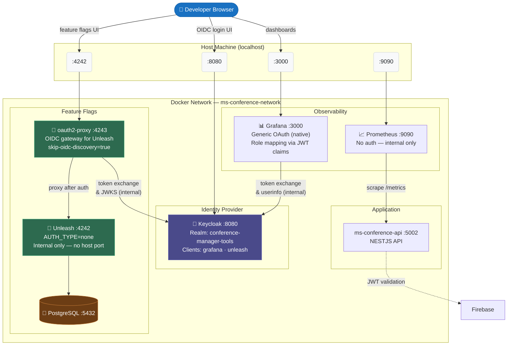
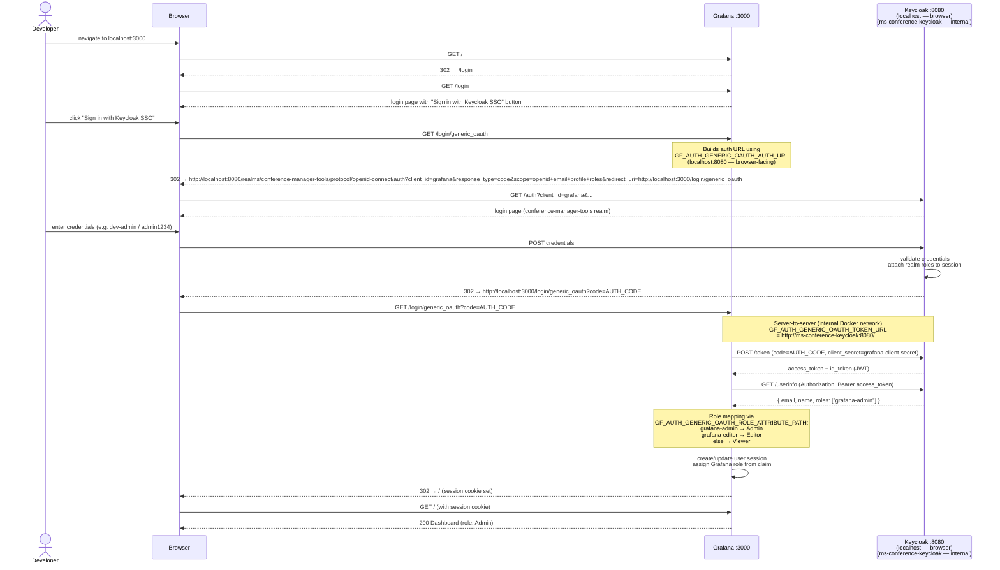
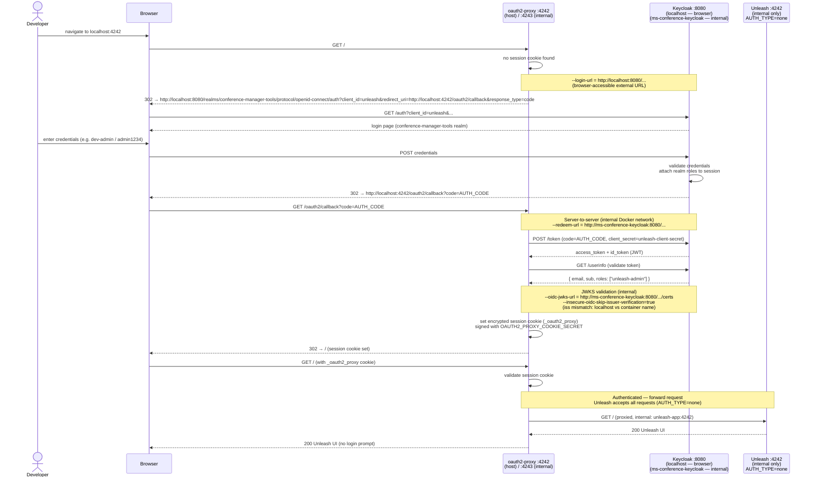
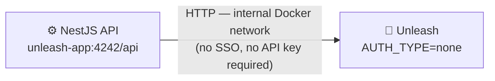

# SSO — Architecture & Auth Flows

Keycloak acts as the single Identity Provider (IdP) for the observability and feature-flag tooling tier. The NestJS API continues to use Firebase as its own IdP (separate concern, separate auth boundary).

---

## Container Architecture

---

## Auth Flow 1 — Grafana via Native Generic OAuth

Grafana ships with built-in Generic OAuth / OIDC support. No proxy is needed — Grafana handles the Authorization Code flow internally.

**URL split:** The browser redirect uses `localhost:8080` (host-accessible). The server-side token exchange uses the Docker container name `ms-conference-keycloak:8080` (internal only). This is configured via separate `GF_AUTH_GENERIC_OAUTH_AUTH_URL` vs `GF_AUTH_GENERIC_OAUTH_TOKEN_URL` env vars.

---

## Auth Flow 2 — Unleash via oauth2-proxy

Unleash OSS v8 has no native OIDC support (Enterprise feature). oauth2-proxy acts as an SSO gateway: it handles the full Keycloak OIDC flow, then forwards authenticated requests to Unleash. Unleash runs with `AUTH_TYPE=none` — the proxy is the sole authentication gate.

**URL split:** Same principle as Grafana. `--login-url` uses `localhost:8080` (browser redirect). `--redeem-url`, `--validate-url`, and `--oidc-jwks-url` use `ms-conference-keycloak:8080` (server-to-server, internal). `--skip-oidc-discovery=true` enables this split; otherwise all endpoints would be derived from the discovery document and use a single hostname.

---

## Internal Unleash Access (NestJS API — no proxy)

The NestJS API reads feature flags directly from Unleash using the internal Docker network, bypassing oauth2-proxy entirely. This path is never exposed externally.

---

## Port Reference

| Port | Exposed to host | Service | Auth gate |
|------|----------------|---------|-----------|
| `3000` | Yes | Grafana | Keycloak SSO (native Generic OAuth) |
| `4242` | Yes | oauth2-proxy | Keycloak SSO (OIDC proxy) → Unleash |
| `4242` (internal) | No | Unleash | None (`AUTH_TYPE=none`) |
| `8080` | Yes | Keycloak | Keycloak admin credentials (`master` realm) |
| `5002` | Yes | API (NESTJS API) | Firebase JWT |
| `9090` | Yes | Prometheus | None (dev — restrict in production) |

## Key Environment Variables

| Variable | Service | Purpose |
|----------|---------|---------|
| `KEYCLOAK_ADMIN_USERNAME` / `KEYCLOAK_ADMIN_PASSWORD` | Keycloak | Bootstrap admin for `master` realm |
| `KEYCLOAK_GRAFANA_CLIENT_SECRET` | Grafana | OIDC client secret — must match realm JSON |
| `KEYCLOAK_UNLEASH_CLIENT_SECRET` | oauth2-proxy | OIDC client secret — must match realm JSON |
| `OAUTH2_PROXY_COOKIE_SECRET` | oauth2-proxy | Encrypts the `_oauth2_proxy` session cookie (24-byte base64url) |
| `GRAFANA_ADMIN_PASSWORD` | Grafana | Local fallback admin — kept as emergency access if SSO breaks |

## Dev Test Users

Provisioned via `tools/keycloak/realms/conference-manager-tools-realm.json` on every `reset-keycloak`.

| Username | Password | Grafana role | Unleash access |
|----------|----------|-------------|----------------|
| `dev-admin` | `admin1234` | Admin | Full (unleash-admin role) |
| `dev-editor` | `editor1234` | Editor | — |
| `dev-viewer` | `viewer1234` | Viewer | Read-only (unleash-viewer role) |
