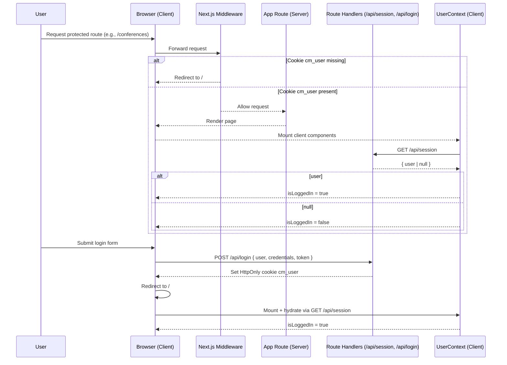

# Authentication & Redirect Flow

- Middleware: [middleware.ts](../middleware.ts) enforces redirect to `/` when `cm_user` is absent on non-public routes.
- Session endpoint: [src/app/api/session/route.ts](../src/app/api/session/route.ts) returns the user based on the HttpOnly cookie.
- Login endpoint: [src/app/api/login/route.ts](../src/app/api/login/route.ts) sets/clears the `cm_user` cookie.
- Client context: [src/app/lib/contexts/UserContext.tsx](../src/app/lib/contexts/UserContext.tsx) hydrates from `/api/session` and exposes `login/logout`.
- Shared API: [src/app/shared/api/index.ts](../src/app/shared/api/index.ts) provides `Authentication.verifyAuth/login/logout` helpers.
