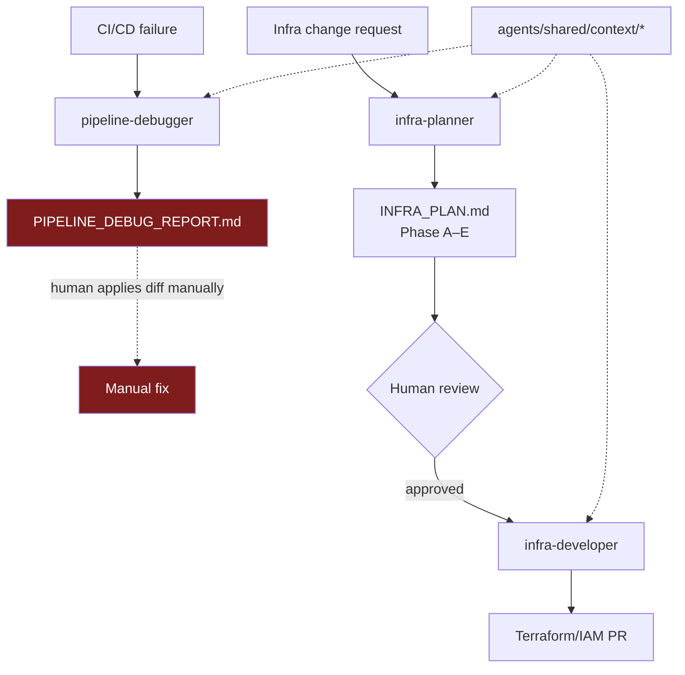
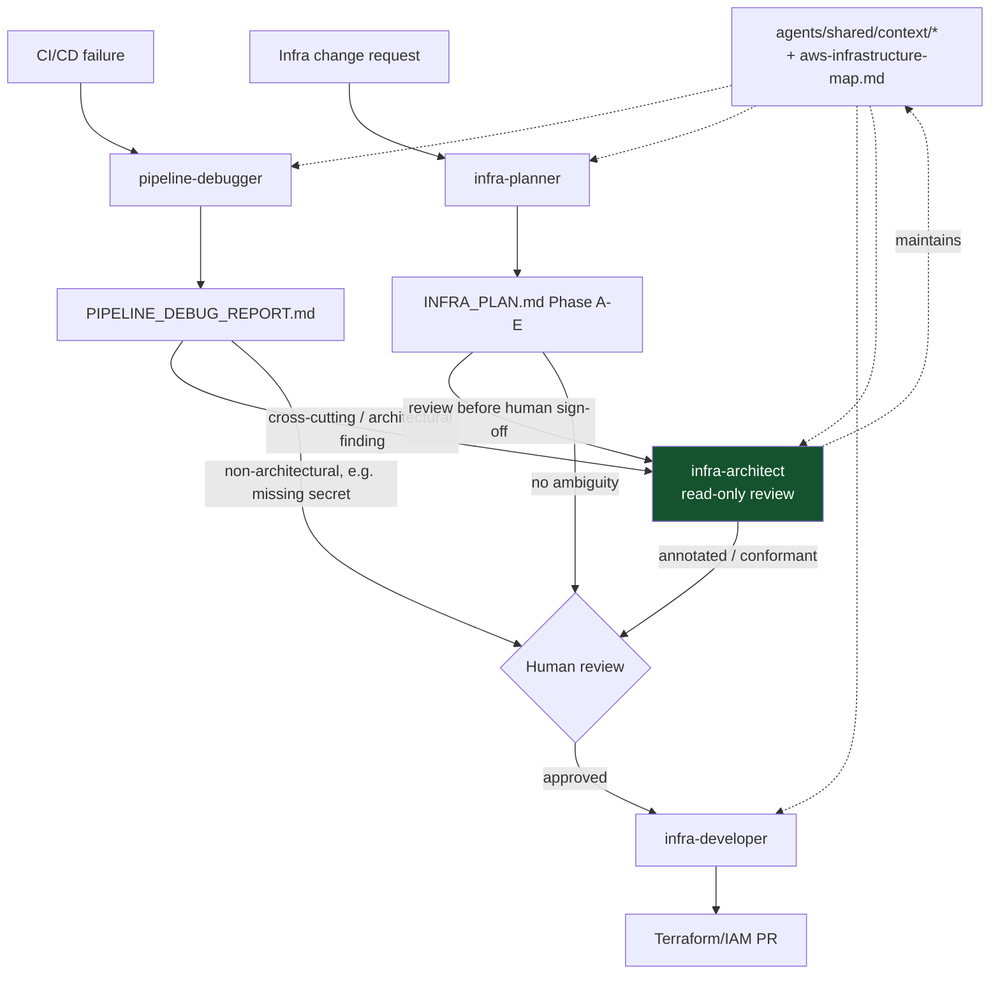

# Infrastructure Agent Architecture Review

Scope: `agents/infrastructure/*`, `agents/shared/context/*`, and how they map onto
`cloud/terraform/aws` (Terraform modules + `iam/` templates + `makefiles/`) and
`.github/workflows/*`. Proposal only — no agent/skill files are changed by this doc.

**Method:** full read of every `AGENT.md`/`SKILL.md` under `agents/infrastructure/`
and `agents/shared/context/`; full read of `cloud/terraform/aws/iam/`,
`cloud/terraform/aws/makefiles/`, `module/iam/`, `.github/workflows/*.yml`, and the
archived `INFRA_PLAN*.md` handoff artifacts; verification of the highest-stakes
claims below directly against source (`grep`/`find`), not taken on faith; external
research against Anthropic's published Claude Code subagent, Agent Skills, and
Agent SDK documentation (see §4).

---

## 1. Current Architecture

### 1.1 Agents

| Agent | Source | Output | Tools/constraints |
|---|---|---|---|
| `pipeline-debugger` | `agents/infrastructure/pipeline-debugger/AGENT.md` | `PIPELINE_DEBUG_REPORT.md` (diffs only) | Read-only `gh` CLI; never edits workflows or secrets |
| `infra-planner` | `agents/infrastructure/infra-planner/AGENT.md` | `INFRA_PLAN.md` (5-phase A–E audit) | Read-only Terraform/AWS CLI; never `apply`/edits `.tf` |
| `infra-developer` | `agents/infrastructure/infra-developer/AGENT.md` | `.tf`/IAM files + completion report | Writes `.tf`; never `apply`/`destroy` |

`AGENTS.md` documents a strictly linear handoff: `infra-planner → INFRA_PLAN.md → infra-developer`.
`pipeline-debugger` is listed as a peer but has **no documented handoff into or out of** that chain — it is a dead end that produces a report a human must act on manually.

### 1.2 Skills

`infra-planner` owns five skills, each producing one lettered phase of `INFRA_PLAN.md`, run in a fixed order:

```
terraform-module-auditor (A, static) → makefile-iam-auditor (B, static)
  → aws-live-auditor (C, live AWS) → iam-template-validator (D, drift)
  → iam-permission-simulator (E, simulate-principal-policy — authoritative fix list)
```

This is a well-designed, composable pattern — it already reasons across Terraform, the `iam/*.json.tpl` Makefile templates, and live AWS/OIDC state, and the archived plans (`agents/infrastructure/plans/archived/*.md`) show it correctly diagnosing real multi-layer IAM bugs (missing `assume_role` wiring, drifted managed policies, wrong role targeted by `AWS_ROLE_ARN`).

`infra-developer` owns two skills: `terraform-ecs-fargate` (Phase A) and `iam-roles-ecs` (Phase B). Both ship a **generic, hard-coded reference implementation** (example `.tf` for task roles, execution roles, and a GitHub OIDC role) rather than describing the repo's actual patterns.

`pipeline-debugger` owns one skill, `gha-debugger` — four static failure patterns (OIDC, ECR push, ECS deploy, missing secrets/vars), diagnosed purely from workflow YAML + `gh run` logs.

### 1.3 Shared context (`agents/shared/context/`)

| File | Contents | AWS/IAM/OIDC content? |
|---|---|---|
| `monorepo-paths.md` | Path aliases only (`TERRAFORM_AWS`, `GHA_WORKFLOWS`, etc.) | None — pure path table |
| `commit-conventions.md` | Conventional Commits types/scopes (`iam`, `ecs`, `ecr`, `gha`…) + example commit messages | Only incidentally, inside example commit bodies |
| `development-guidance.md` | Container-first Makefile workflow per package | Lists only `init/plan/apply/destroy` for `cloud/terraform/aws` |

**Filename check:** CLAUDE.md does not reference either `commit-conventions.md` or `conventional-commits.md` by name, and only `commit-conventions.md` exists on disk — no naming drift, this is a non-issue.

### 1.4 Current workflow



The dotted red path is the structural weak point: `pipeline-debugger`'s findings never feed `infra-planner`, so architectural root causes it can't resolve alone (e.g. "which IAM role does this secret actually point to?") have nowhere to go.

---

## 2. Gap Analysis

### 2.1 `pipeline-debugger` cannot see the Makefile/IAM layer at all

`gha-debugger` diagnoses OIDC failures by checking the workflow's `permissions:` block and whether `AWS_ROLE_ARN` is *set* — it never checks what that ARN resolves to, whether that role is Makefile-managed, or whether its trust/identity policy is intact. The archived plans show this exact question — "which role does `AWS_ROLE_ARN` actually target, and who owns it?" — took **three sequential PRs/addenda** (`INFRA_PLAN_20260505.md`, `INFRA_PLAN_PR_20260512.md`, `INFRA_PLAN_PR_140_20260514.md`) to answer, because `appdevexp-deployer` (Makefile-owned, correctly configured) and `GitHubActionsTerraformRole` (not defined by any `.tpl`, silently lost its policy) look identical from a workflow-YAML standpoint. `pipeline-debugger` has no way to ask this question and no handoff path to an agent that can.

**The `GitHubActionsTerraformRole` reference is confirmed dangling, not hypothetical.** It appears in exactly two places: `cloud/terraform/aws/iam/service-trust-policy.json.tpl:14` (a role allowed to assume the KMS service role) and `module/kms/variables.tf:12` (the *default value* of `terraform_role_name`, consumed by `module/kms/main.tf:30` to build a key-policy principal ARN). No `.tpl` bootstrap target in `aws-roles.mk` and no `aws_iam_role` resource anywhere in `module/` ever creates a role by this name — it is a string that both the Makefile-IAM system and the Terraform-IAM system assume the *other* one owns, and neither does. This is exactly the class of bug `pipeline-debugger`/`infra-planner` are structurally blind to today: it's invisible from `.tf` syntax (valid HCL, valid JSON template) and invisible from workflow YAML (nothing in `.github/workflows/*` references this name at all).

**The broader picture: IAM here is a credential-broker chain, and OIDC trust is intentionally repo-wide, not per-branch.** `appdevexp-deployer` (the one role GitHub Actions assumes via OIDC, per `terraform-trust-policy.json.tpl`) is deliberately thin — it only has `terraform-backend` and `ecr-push` permissions — and must `sts:AssumeRole` into five separate service roles (ecs-deploy, kms-manage, waf, logs, s3-manage) for Terraform to actually get anything done. The trust condition on `terraform-trust-policy.json.tpl` is scoped only to `token.actions.githubusercontent.com:sub: repo:__GITHUB_USER__/__REPO_NAME__:*` — no branch, environment, or event-type restriction, despite workflows declaring `environment: DEV`. This is a legitimate, deliberate design (broker pattern + broad-but-single-repo trust), but **no shared context document states it as the intended design** — so an agent encountering an `AccessDenied` on `sts:AssumeRole` mid-chain, or reviewing the trust policy for tightening, has no way to distinguish "this is the architecture" from "this is a misconfiguration."

### 2.2 Two independently-defined IAM role sets for ECS runtime, and no agent owns reconciling them

Confirmed in `cloud/terraform/aws`: `makefiles/aws-roles.mk`'s `bootstrap-runtime-roles` target creates `appdevexp-task-execution-role` and `appdevexp-$(APP_NAME)-task-role` via raw `aws iam` CLI calls, while `module/iam/main.tf` independently creates **differently-named** Terraform-native roles — `${application_name}-ecs-role-manager`, `${application_name}-task-execution-role`, `${application_name}-app-task-role` — that are the ones actually wired into `module.ecs_app` and used by running tasks. Editing the Makefile-side templates has zero effect on production permissions. Both provisioning paths also diverge in policy content (the Makefile version is broader — Secrets Manager/SSM/S3/observability; the Terraform version scopes to Secrets Manager + KMS + EFS only), so this isn't just a naming collision, it's two independently-maintained permission surfaces. None of `infra-planner`'s five skills currently check "which of these two role sets does the live ECS task definition actually reference" as an explicit first step — `iam-template-validator` derives role names from the live task definition (good), but nothing documents *why* two systems exist or flags it as a standing risk to watch for on every audit.

Compounding this: none of the four `makefiles/*.mk` files (`aws-backend.mk`, `aws-roles.mk`, `aws-ecr.mk`, `aws-secrets.mk`) are invoked from any `.github/workflows/*.yml` — they are run manually, out-of-band, by a human admin, while CI only ever runs `terraform init/plan/apply` against `module/`. So the entire IAM bootstrap layer is invisible to CI and to any agent that only reads workflow files or `.tf` diffs.

### 2.3 `infra-developer`'s skills encode a fictional reference architecture

`iam-roles-ecs`'s example `github_actions_role.tf` creates the GitHub OIDC role and its trust policy **directly in Terraform**. The real repo does the opposite: OIDC role creation is deliberately kept out of Terraform, in `makefiles/aws-roles.mk`, precisely so that Terraform's own credentials don't have to bootstrap themselves. Role-naming in the skill (`${var.app_name}-ecs-execution-${var.environment}`) also matches neither of the repo's two real naming schemes. If `infra-developer` followed this skill literally, it would create a **third** parallel IAM system, compounding the problem in §2.2 rather than fixing it. This is the single highest-value skill fix in the repo.

### 2.4 Shared context is stale/incomplete relative to the real infra layer

`development-guidance.md`'s Terraform section lists exactly four targets (`init`, `plan`, `apply`, `destroy`) for `cloud/terraform/aws` and never mentions `makefiles/aws-roles.mk`, `aws-backend.mk`, `aws-ecr.mk`, or `aws-secrets.mk` — the entire IAM/OIDC/ECR/Secrets bootstrap system, and its **mandatory run order** (`bootstrap-boundary` → `bootstrap-deployer` → `bootstrap-service-roles` → `bootstrap-runtime-roles`), is invisible to any agent reading only shared context. Separately, `cloud/terraform/aws/docs/ADMIN_SETUP.md` describes a static IAM-user/access-key model that no longer exists in code (the repo migrated to OIDC) — if any agent or skill were to ingest that doc directly, it would hallucinate nonexistent `make create-user`/`make create-keys` targets. Neither of these repo-native docs should be pulled into agent context as-is without reconciliation first.

### 2.5 No agent owns the "cross-cutting" question class

Every concrete production incident in the archived plans (`INFRA_PLAN_20260505.md` Phase A finding #1: provider has no `assume_role`, so Terraform silently runs as an under-privileged identity; the PR #140 addenda: wrong role targeted by CI) is a **cross-layer** question spanning GitHub Actions config, Makefile-owned IAM, and Terraform provider wiring simultaneously. `infra-planner` is scoped to "audit Terraform + IAM, produce a plan" and `pipeline-debugger` is scoped to "diagnose workflow YAML" — neither has a mandate to maintain a standing answer to "how do these three systems fit together, and what's the current known-good baseline." This is a governance gap, not an auditing gap — audits (Phase A–E) already do excellent point-in-time diagnosis; nothing owns the durable map.

### 2.6 The entire agent/skill system is a documentation convention, not a Claude Code harness feature — confirmed, not assumed

Checked directly: this repo's `.claude/` directory contains only `settings.json`, `settings.local.json`, `scheduled_tasks.lock`, and `commands/debug-pipeline.md`. There is **no** `.claude/agents/` and **no** `.claude/skills/` directory anywhere in the repo. Claude Code's real subagent mechanism — isolated context window per subagent, `tools`/`disallowedTools` allowlists enforced by the harness itself, `description`-based automatic delegation — requires files in exactly those locations with specific YAML frontmatter (`name`, `description`, `tools`, `model`, etc.). None of that exists here. What exists instead is `.claude/commands/debug-pipeline.md`, a slash command whose entire body is a prose instruction: *"act as `pipeline-debugger` using the `gha-debugger` skill."* This is the **only** real integration point between this repo's `agents/` convention and the actual product — everything else (`AGENT.md`, `SKILL.md`, "Act as X", the constraint bullet lists in `docs/agents/PROMPTS.md`) is a hand-rolled prompting convention that depends entirely on the model choosing to comply, not the platform enforcing it.

Concretely, this means every constraint in every `AGENT.md` (`❌ Never run terraform apply`, `❌ Never modify .github/workflows/*.yml directly`) is advisory prose. There is no tool allowlist blocking `infra-planner` from actually invoking `terraform apply`, and no automatic delegation — a user or orchestrating session must explicitly say "act as infra-planner," Claude cannot pick the right infra agent from a natural-language request the way it can with a real `.claude/agents/*.md` subagent. This is the single largest structural gap versus documented Claude Code practice, and it's easy to miss because a well-written `AGENT.md` *reads* like a real subagent spec.

### 2.7 Skills are nested per-agent, blocking reuse

Every skill lives under its owning agent's own `skills/` directory (e.g. `agents/infrastructure/infra-planner/skills/terraform-module-auditor/`). If a future agent (see §3.3) needs to reuse `terraform-module-auditor`'s knowledge, today that means duplicating it rather than pointing at a shared location.

---

## 3. Proposed Architecture

### 3.1 Design rationale

Keep the existing three agents' single responsibilities intact — the planner/developer split with a human-approval gate is a legitimate, already-validated instance of the industry-standard Planner→Executor pattern (confirmed against Anthropic's own Agent SDK and Claude Code subagent guidance: file-based plan artifacts are a *more* durable version of the SDK's recommended "structured artifact over raw prompt" handoff — keep `INFRA_PLAN.md`/`PIPELINE_DEBUG_REPORT.md` as-is). The gaps above are not "wrong agents," they're **missing shared knowledge** and a **missing cross-cutting role**. Fix in that order: shared context first, then close the loop between the two disconnected agents, then decide on `infra-architect`.

### 3.2 Updated shared context

Add one new file: `agents/shared/context/aws-infrastructure-map.md`, covering exactly the knowledge no single agent currently owns:

- The dual IAM provisioning system (Makefile `.json.tpl` + AWS CLI vs. Terraform-native `module/iam`) and **which one actually backs the running ECS tasks** (module/iam's output, wired into `module.ecs_app`).
- The 6-provider-alias chain (`aws.ecs`, `aws.kms`, `aws.logs`, `aws.waf`, `aws.s3` → their respective Makefile-created service roles) and the fact that `terraform plan`/`apply` silently `implicitDeny`s if this wiring is broken — it does not tell you IAM is the problem.
- The Makefile bootstrap order (`bootstrap-boundary` → `bootstrap-deployer` → `bootstrap-service-roles` → `bootstrap-runtime-roles`) and that it is **manual, admin-only, never run from CI**.
- A short "known failure taxonomy" (the 4 classes found in this review: missing action on `.tpl` after a new `.tf` resource; CI secret pointing at an unmanaged role; divergent Makefile-vs-Terraform role definitions; Terraform resources depending on Makefile-created resources with no cross-tool `depends_on`).
- Cross-reference to (but not verbatim copy of) `cloud/terraform/aws/docs/*` once reconciled (see Roadmap Phase 4).

Update `development-guidance.md`'s Terraform section to at least name the four `makefiles/*.mk` files and their bootstrap order, even if full detail lives in the new map file.

### 3.3 `infra-architect` — recommendation: **introduce as a dedicated, strictly read-only agent**

Evaluated against the three options:

- **Shared skill (rejected):** a skill is invoked *by* an existing agent, it can't stand between two agents or run independently when a question doesn't fit either existing agent's phase model. The recurring failure class in §2.1/§2.5 is exactly this kind of orphaned cross-cutting question.
- **Stay distributed (rejected):** already tried, implicitly — it's why the same root-cause hunt took three PR cycles. `infra-planner`'s five skills are individually excellent but none is chartered to maintain a standing cross-layer map; adding that as a sixth skill would overload an already-specific agent (audit-and-produce-a-plan) with an ongoing-governance responsibility that has a different cadence and different tools (no live-audit trigger needed).
- **Dedicated agent (recommended):** give it a distinct, narrower permission profile than any existing agent — `Read`/`Grep`/`Glob` plus read-only `aws` CLI, **no** `Edit`/`Write`/`Bash(terraform apply|destroy)` — matching the "read-only governance/verifier" pattern Anthropic's own docs recommend for `Explore`/`Plan`-style agents. Its two responsibilities:
  1. **Own and maintain** `agents/shared/context/aws-infrastructure-map.md` (the map in §3.2) — updated whenever a new module, provider alias, or Makefile target is added.
  2. **Review, don't re-audit** — `infra-architect` reads `INFRA_PLAN.md` (from `infra-planner`) or `PIPELINE_DEBUG_REPORT.md` (from `pipeline-debugger`) and checks it against the map and a short set of standards (module boundaries, least-privilege, naming conventions) *before* the human-approval gate, flagging anything that looks like it's fixing the wrong layer (the exact mistake made across the archived PR #140 addenda). It does not run its own live-state audits — that's `infra-planner`'s job.

This keeps `infra-architect` genuinely lightweight: no new skills to audit, one skill to write/maintain the map, and a review checklist. It participates in the workflow, it doesn't gate every task — plans without cross-cutting ambiguity can go straight to human review as they do today.

### 3.4 Skill changes

| Skill | Change | Why |
|---|---|---|
| `iam-roles-ecs`, `terraform-ecs-fargate` | Rewrite examples to reference the repo's **actual** module structure (`module/iam`, `module/ecs-app`, real role names) instead of a generic reference implementation; explicitly note "GitHub OIDC role is Makefile-managed, not created here" | Closes §2.3 — the highest-risk finding in this review |
| `gha-debugger` | Add a step: resolve `AWS_ROLE_ARN`'s live identity and check `aws-infrastructure-map.md` for whether it's Makefile-managed before diagnosing further | Closes §2.1 |
| `terraform-module-auditor` / `iam-template-validator` | Add an explicit early check: "does this task definition's role match Makefile-bootstrap naming or `module/iam` naming — confirm only one is live" | Closes §2.2 |
| All infra skills | Point their "load paths" step at the new `aws-infrastructure-map.md` alongside `monorepo-paths.md` | Closes §2.4 |
| (new, owned by `infra-architect`) `aws-architecture-map-maintainer` | Single skill: how to update the map file when infra changes | Supports §3.3 |

Skills stay nested under their owning agent for now — reuse pressure is currently limited to `infra-architect`'s one map-maintenance skill, which doesn't need anything the other agents own. Revisit shared-skill location (`agents/infrastructure/skills/`) only if a second cross-agent reuse case appears (see Roadmap Phase 5 note).

### 3.5 Collaboration model



Both `pipeline-debugger` and `infra-planner` gain one new optional step: escalate to `infra-architect` when a finding looks cross-layer (spans GH Actions + Makefile IAM + Terraform) rather than single-layer. Straightforward findings (a missing secret, a single `.tf` typo) skip `infra-architect` entirely and go straight to human review, same as today — this keeps the common case fast.

---

## 4. External Research & Comparison Against Industry Practice

Sources reviewed: Claude Code subagents docs (`code.claude.com/docs/en/sub-agents`), Agent Skills overview and authoring best practices (`platform.claude.com/docs/en/agents-and-tools/agent-skills/*`), Anthropic engineering posts "How we built our multi-agent research system" and "When and how to build multi-agent systems," Claude Code Action / GitHub Actions docs, and the community `wshobson/agents` plugin marketplace (94 plugins / 203 agents / 175 skills).

| Pattern | Anthropic / community guidance | This repo today | Recommendation |
|---|---|---|---|
| Planner/Executor split | "Use subagents when the work is self-contained and can return a summary" — legitimate when mediated by a durable, reviewable artifact | Already present (`infra-planner`/`infra-developer`) via `INFRA_PLAN.md` | Keep; add `infra-architect` as the Verifier now that complexity (§2.5) demands it |
| File-based plan handoff | Multi-agent research system post: subagents should return compact structured results, and the lead agent persists its plan to durable state (not just conversation) precisely because long-running work needs to survive context truncation | Already present (`INFRA_PLAN.md`, `PIPELINE_DEBUG_REPORT.md`) | Keep as-is — this repo's pattern is a *stronger*, git-diffable version of the documented pattern |
| Native subagent frontmatter (`.claude/agents/*.md` with `name`/`description`/`tools`/`disallowedTools`/`model`) | Required for context isolation, automatic description-based delegation, and harness-enforced tool restriction | **Confirmed absent** (§2.6) — no `.claude/agents/` or `.claude/skills/` directory exists; only one prose slash command (`debug-pipeline`) | Add in Roadmap Phase 3 — this converts every "never do X" constraint from advisory to platform-enforced |
| Skill granularity (frontmatter `description` ≤1024 chars stating both *what* and *when*, body ≤500 lines/5k tokens, references one level deep with a TOC over 100 lines) | Explicit authoring checklist | Skills are appropriately sized, but frontmatter descriptions were not audited against the third-person/what+when rule | Add a lightweight description-quality pass in Roadmap Phase 2 |
| Shared/reusable skills across agents | Domain-partitioned reference files loaded on demand avoid duplication without a "context penalty for bundled content that isn't used" | Skills are agent-nested; no duplication yet, but no reuse path either | Leave nested until a second reuse case appears; don't build shared-skill infra speculatively |
| Read-only governance/reviewer agent | Explicit pattern: tool restriction is the enforcement mechanism for scope (e.g. a review-only agent literally cannot call `Write`/`Edit`) | Absent | `infra-architect`, scoped exactly this way — `Read`/`Grep`/`Glob` + read-only `aws` CLI, no `Edit`/`Write`/`terraform apply\|destroy` |
| Avoid role-based (not context-based) decomposition | Named anti-pattern, quoted directly: *"Dividing by type of work (one agent writes features, another writes tests, a third reviews code) creates constant coordination overhead"* — split only where context is genuinely separable | The planner/developer split avoids this trap because it's mediated by a durable, human-approved artifact rather than live back-and-forth | Keep `infra-architect` as an **optional escalation**, not a mandatory always-on reviewer in the loop — an always-on reviewer that shares most context with `infra-planner` would recreate the coordination-overhead anti-pattern this repo has so far avoided |
| Multi-agent token/cost overhead | Documented as "3-10x" to "~15x" more tokens than a single-agent approach for equivalent tasks | N/A today (3 agents, file-mediated handoff, not live multi-agent orchestration) | A reason *not* to make `infra-architect` gate every plan — keep it conditional (§3.5), matching the guidance to start single-agent and add multi-agent only where context truly can't be shared |

---

## 5. Implementation Roadmap

| Phase | Work | Complexity | Depends on | Risk |
|---|---|---|---|---|
| **1. Shared context** | Write `agents/shared/context/aws-infrastructure-map.md` (dual IAM system, provider-alias chain, bootstrap order, failure taxonomy); update `development-guidance.md`'s Terraform section to name the 4 Makefiles | Low | None | Low — pure documentation; risk is it goes stale if not owned (mitigated by Phase 5) |
| **2. Skill fixes** | Rewrite `iam-roles-ecs`/`terraform-ecs-fargate` examples to match real module structure; add the "resolve `AWS_ROLE_ARN` identity" step to `gha-debugger`; add the "which role set is live" check to `iam-template-validator` | Medium | Phase 1 (skills should cite the new map) | Medium — must be verified against current live AWS state (roles/ARNs) so examples don't go stale immediately; validate with a read-only `terraform-module-auditor` + `aws-live-auditor` run before committing |
| **3. Agent frontmatter/enforcement** | Create real `.claude/agents/pipeline-debugger.md`, `.claude/agents/infra-planner.md`, `.claude/agents/infra-developer.md` (proper `name`/`description`/`tools`/`disallowedTools`/`model` frontmatter, pointing back to the existing `AGENT.md` for the full spec so it stays the single source of truth); consider a `PreToolUse` hook blocking `terraform apply\|destroy` as a second, harness-level backstop | Low–Medium | None (independent of 1/2) | Low — additive; test that legitimate `terraform plan`/`validate` calls still pass the allowlist |
| **4. Reconcile stale docs** | Rewrite `cloud/terraform/aws/docs/ADMIN_SETUP.md` (currently describes a static-IAM-user model that no longer exists) and the root `README.md`'s workspace-based Terraform instructions to match the real OIDC/single-tfvars flow; then link from the new shared-context map instead of duplicating | Medium | Phase 1 | Medium — requires a human/infra-owner to confirm current intended process, since the doc and code have diverged for a while |
| **5. Introduce `infra-architect`** | Create `agents/infrastructure/infra-architect/AGENT.md` (read-only tools) + its one map-maintenance skill; wire the optional escalation step into `pipeline-debugger`'s and `infra-planner`'s `AGENT.md` (when to hand off); update `AGENTS.md`'s orchestration rules and handoff protocol | Medium–High | Phases 1–3 (needs the map to exist and frontmatter conventions decided first) | Medium — the main risk is over-gating: keep the escalation optional/conditional so simple fixes don't get routed through an extra review step unnecessarily |

Phases 1–3 are independently valuable and low-risk; do them regardless of whether `infra-architect` is ultimately adopted. Phase 5 is the only phase contingent on accepting the new-agent recommendation in §3.3.

**Out-of-band note, not part of the phased plan:** §2.1 confirms `GitHubActionsTerraformRole` (referenced by `iam/service-trust-policy.json.tpl` and defaulted in `module/kms/variables.tf`) is not created by any Makefile target or Terraform resource in this repo. Whether that's a stale reference safe to delete or a role that exists out-of-band in the live AWS account and was just never codified is a one-AWS-CLI-call question (`aws iam get-role --role-name GitHubActionsTerraformRole`) worth answering before or during Phase 1, independent of the rest of this roadmap.
