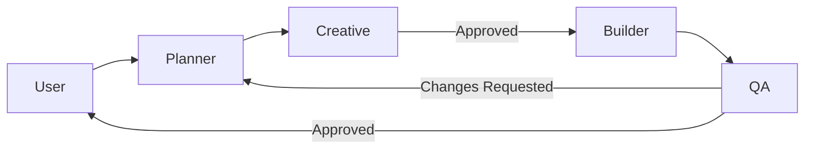

# Agent Architecture

## Overview
This repository uses a multi-agent workflow to automate development tasks using Planner, Creative, Builder, and QA agents.

## Workflow

## Description of Flow
- **Planner** creates an actionable plan.
- **Creative** validates clarity and completeness.
- **Builder** writes code following the approved plan.
- **QA** verifies correctness and quality.
- **If QA fails**, work returns to **Planner** or **Builder** depending on issue complexity.

## Benefits
- Avoids misunderstandings.
- Enforces monorepo standards.
- Produces consistent, high-quality code.
- Reduces manual review load.
